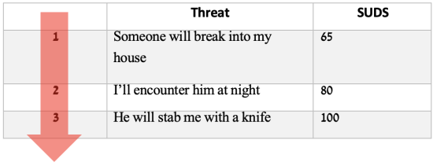

## Subjective Units of Distress (SUDS)

We now turn to get a more personalized understanding of what triggers your anxiety.

Before we begin identifying your core threat, let's take a moment to explain what subjective units of distress (SUDS) are, since you will be using this scale multiple times throughout the process.
SUDS are a measure of the level of discomfort you're experiencing, ranging from 0 to 100.

Take a moment to imagine:

- A situation where you don't experience any discomfort at all - this is your **0 point**.
- An experience where you felt the most distressed you've ever felt - this is your **100 point**.
- A situation where you experienced discomfort or distress, but it was still tolerable for you - this is your **50 point**.

*Tip: When rating a feeling, compare it to your 0, 50, and 100 points to see where it truly falls.*

**What level of distress are you currently experiencing?**

\[ \text{0} \hspace{0.5cm} \rule{8cm}{0.4pt} \hspace{0.5cm} \text{100} \]

\newpage

## Understanding the Source of Fear

To begin understanding the source of your fear, select a situation or object that causes fear, anxiety, or distress for you. After that, we will examine the underlying factors of your anxiety.

For each of the following questions, provide one or two significant responses, if applicable. If not applicable, enter **NA**.

**Are there any situations or objects that cause you to experience fear or anxiety?**  
Example: Some individuals may fear spiders, while others may fear public speaking.  
`________________________________________________________________`  
`________________________________________________________________`  

**Do you avoid any particular activities in order to prevent feelings of stress, anxiety, or distress?**  
Example: Some people may avoid social activities like meeting friends, while others may avoid crowded places or riding on buses.  
`________________________________________________________________`  
`________________________________________________________________`  

**Are there any activities or personal rituals that you feel compelled to do to avoid stress, anxiety, or distress?**  
Example: Some people repeatedly wash their hands to avoid feeling contaminated, while others ask for reassurance or carry items "just in case."  
`________________________________________________________________`  
`________________________________________________________________`  

**Out of all the situations you described, which one evokes the most distress and negative effects on your life?**  
*Tip: Imagine you have a magic wand to eliminate one fear. Which situation would you choose? Describe it in detail.*  
`________________________________________________________________`  

**What would be the level of your distress (SUDS) if the situation you described actually happened?**
If you mentioned avoidant behaviors or rituals, what would be the distress level if you did *not* engage in them?

\[ \text{0} \hspace{0.5cm} \rule{8cm}{0.4pt} \hspace{0.5cm} \text{100} \]

\newpage

## Finding the Underlying Threat

We want to delve deeper and understand the root of your fear.
When most people consider the things that frighten them, they tend to focus on the specific object or situation that scares them.
However, we want to explore the underlying threat that fuels this fear - this is what we refer to as the "core threat".
Please carefully read these two examples:   

**Example 1: **

> Dianne worries about whether she locked the door before going to bed, and as a result, she checks the lock multiple times every night.
> After reflecting on her fear, she realizes that her deeper fear is a burglar breaking in, attacking her, and her subsequently dying.
> For Dianne, the thought of dying is the most terrifying thing, especially if it were to happen as a result of her forgetfulness.

Her core threat is the possibility of dying and being responsible for it.

**Example 2:**

> Similarly, George is also anxious about whether he locked the door.
> Upon further examination of his fear, he realizes that his primary concern is that burglars will break in and steal all of his belongings.
> However, his greater fear is that his family will be angry with him and reject him as a result.
> He worries that he will remain lonely and miserable for the rest of his life, which is the worst outcome he can imagine.

His core threat is being disconnected from his family and being alone forever.
 
We aim to identify your core threat.
To do so, consider what could happen if the thing you fear became a reality.
This approach helps reveal a deeper fear.
For each fear you identify, we will prompt you to repeat the process until you reach your deepest fear.
This process can be anxiety-provoking and stressful for many people.
If you experience these feelings, please know that you are not alone.

The table below is intended to assist you in identifying your core threat.   

Here is Dianne’s table:

And now it is your turn – below is the fear you have described:

> << Insert Focal Fear Here >>

**What would be the implications if your fear came true?**

In each row, please write down the most terrifying outcome that you believe could follow the fear mentioned in the row above.
We are want to know what you feel would happen, rather than what you think is realistic.
You do not need to complete all of the rows, but please fill in at least three.

| **SUDS** | **Threat**         |
|----------|--------------------|
| 1        | `________________` |
| 2        | `________________` |
| 3        | `________________` |
| 4        | `________________` |
| 5        | `________________` |

\newpage

**After taking the time to deeply understand the root cause of your fear or anxiety, what in a nutshell is your core threat?**

For comparison, here are the lines of reasoning that led Dianne and George to their core threats:   

> Dianne is afraid that she forgot to lock the door at home (which is why she checks the lock several times before going to sleep).
When she thinks more deeply, she realizes that her actual fear is that a burglar will enter the house, she will encounter them, and they will attack her, resulting in her death.
*Her core threat is that she will die*.

Another example:

> George's initial fear is also that he forgot to lock the door at home.
When he thinks about it, he notices that he is worried that burglars will enter the house and steal all their belongings.
He imagines his family's reaction and their anger, and he fears that if it happens, they will reject him, leaving him alone and miserable forever.
For George, being disconnected from his family is the worst thing he can imagine.
*His core threat is that he will be rejected by his family and remain alone forever*.
     
**What in a nutshell is your core threat?**  
Please summarize it in one or two sentences.  
`________________________________________________________________`  

\newpage

Many individuals are afraid of experiencing negative emotions and believe that these emotions constitute their core threat.
However, often these emotions are a cover for even deeper fears.
For example, behind the fear of suffering may be a fear of not being able to function due to that suffering.
   
For instance:
> Anat becomes anxious if her room is not organized the way she wants it to be.
She thinks that her core threat is the fear of feeling uncomfortable.
However, after giving it additional thought, she realizes that she is worried that if she would feel uncomfortable all of the time, she would not be able to perform well at work, and ultimately consider herself a failure.

Similarly:
>Anna is afraid of being in crowded places.
She believes that she will become stressed out and lose control or go insane.
Initially, she thought that her core threat was losing control, but upon further contemplation, she realizes that her fear is to act abnormally due to stress, and subsequently, people will ridicule and reject her.

**Consider your core threat.
Is it the fear of a particular emotional experience?**

If so, what would occur if you were to experience that emotion?

`________________________________________________________________`

\newpage

Each individual experiences the world in a unique way, which is crucial in understanding their core threats.
The same fear can hold very different meanings for different people.
For example, failing a test might mean "I'm worthless" for one person, "I won't get the job I want" for another, and "My family will criticize me" for a third.

**Could you please describe your core threat in a way that someone who doesn't know you could understand how it affects you and why it's personally meaningful to you?**

`________________________________________________________________`

\newpage

**How distressed would you be if your core threat actually occurred?**

\[ \text{0} \hspace{0.5cm} \rule{8cm}{0.4pt} \hspace{0.5cm} \text{100} \]

\newpage

Safety behaviors are strategic actions people use to decrease their anxiety levels or avoid intimidating situations.
There are various types of safety behaviors.
Think about it: **Which strategies have you developed for coping with anxiety?**

Select the safety behaviors you use:

- [ ] **Avoidance**: Many people find ways to avoid being in the intimidating situation.  Example: Not speaking to an intimidating person of authority or not going to crowded places.
- [ ] **Distraction**: Some people distract themselves to avoid experiencing fear.  Example: Walking back and forth or becoming absorbed in their phone.
- [ ] **Self-calming**: Trying to quiet the fear by meditating or searching for information online.
- [ ] **Preparation**: Some people try to always be prepared for a dangerous situation.  Example: Carrying a bottle of water or pills, or always sitting near emergency exits.
- [ ] **Casting responsibility**: Calming oneself by relying on someone else.  Example: A friend, parent, or therapist who will be with them and protect them.

**Please write briefly about the safety behaviors you use to avoid your anxiety.**

`________________________________________________________________`  
`________________________________________________________________`  
`________________________________________________________________`  
`________________________________________________________________`  
`________________________________________________________________`  

\newpage

## Connecting the dots

Up to this point, we have dealt with the anxiety-provoking stimulus and its underlying core threat separately.
Now, we would like to gain a more comprehensive understanding of the relationship between the two.
**Write a brief story in the first person and present tense where you intentionally do not engage in safety behaviors or avoidance, but rather fully take a risk and face your fear.**
Make sure to end the story with a description of how the worst catastrophic outcome that you can imagine (your core threat) happens.

Example 1:

> I decide to go out on a date even though I'm very worried about it.
During the date, the conversation doesn't pick up and stays shallow.
At the end, my date says to me, "Are you really this boring or do you just not know how to communicate with people?
I have no interest in you," and then just leaves the place.
This story repeats again and again, until no one is into me.
I stay alone without a romantic relationship for my entire life.
 
Example 2:

> I'm walking through a sketchy part of town late at night, feeling nervous about the possibility of being mugged.
My heart is pounding in my chest and my hands are shaking, but I force myself to avoid crossing the street or looking around for potential threats.
Suddenly, I hear footsteps behind me and I feel a sharp blow to the back of my head.
The world goes black as I crumple to the ground and die.

Your anxiety provoking situations was:

> << anxiety provoking situation >>

Your core threat was: 

> << core threat  >>

`________________________________________________________________`  
`________________________________________________________________`  
`________________________________________________________________`  
`________________________________________________________________`  
`________________________________________________________________`  
